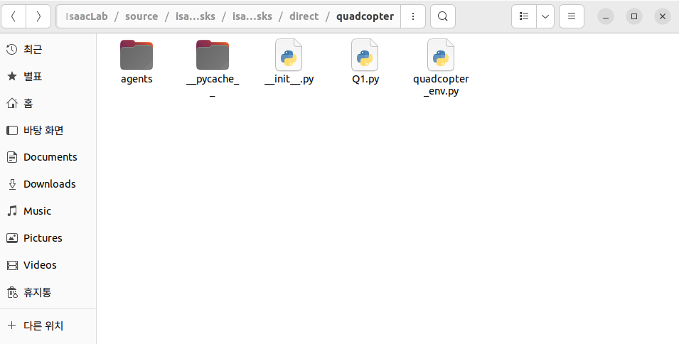

# TIPS

마지막으로 Isaac Lab을 사용해보면서 알고 있으면 좋은 내용들을 정리했습니다. 필수적으로 읽어야 하는 부분은 아니며, Isaac Lab을 사용하다 막히는 부분이 생겼을 때 아래 TIPS 항목들을 참고하시면 도움이 될 수 있습니다.

혹시 Isaac Lab을 사용하는 도중 문제가 발생하거나 문서에 추가되었으면 하는 내용이 있다면, 아래 이메일로 연락주시면 검토 후 TIPS에 반영하도록 하겠습니다.

📩 문의: junho1458@gmail.com


## Available argument

다음은 Isaac Lab에서 train이나 play를 할 때 사용할 수 있는 argument들을 정리해 두었습니다. 대부분은 사용하지 않지만 혹시라도 사용할 수 있으니 필요한 부분을 찾아서 사용하면 되겠습니다. 
<pre>
🔧 주요 Argument 설명

Argument                         설명
------------------------------  ----------------------------------------------
-h, --help                      도움말 메시지 출력
--video                         학습 중 비디오 저장 활성화
--video_length VIDEO_LENGTH     저장할 비디오 길이 (프레임 단위)
--video_interval VIDEO_INTERVAL 몇 iteration마다 비디오를 저장할지
--num_envs NUM_ENVS             병렬 환경 개수 설정 (예: 4096)
--task TASK                     학습할 환경 이름 (예: Isaac-Cartpole-v0)
--seed SEED                     랜덤 시드 값 (재현 가능성 확보용)
--max_iterations MAX_ITERATIONS 최대 학습 iteration 수
--experiment_name EXP_NAME      실험 디렉토리 이름 설정 (logs/ 하위 경로)
--run_name RUN_NAME             동일 실험 내 여러 run을 구분하기 위한 이름
--resume RESUME                 학습 중단 후 이어서 학습할지 여부 (True or False)
--load_run LOAD_RUN             기존 run에서 모델을 로드할 경우 해당 run 이름
--checkpoint CHECKPOINT         로드할 checkpoint 번호
--logger                        사용할 로깅 도구 지정 (wandb,tensorboard,neptune)
--log_project_name LOG_PROJNAME 로깅 툴에서 사용할 프로젝트 이름
--headless                      GUI 없이 headless 모드 실행 
--livestream {0,1,2}            livestream 시각화 모드 설정 
--enable_cameras                환경에서 카메라 사용 여부
--device DEVICE                 연산 디바이스 설정 (cuda, cpu 등)
--verbose                       출력 상세 정보 활성화
--info                          환경의 추가 정보 출력 여부
--experience EXPERIENCE         사전 정의된 경험 설정 사용 (예: curriculum)
--kit_args KIT_ARGS             Omniverse Kit 런타임 인자 전달용
</pre>

train과 play할 때 사용되는 모든 argument들을 정리했습니다. 이 argument들을 터미널에서 전체적으로 사용하게 된다면 다음과 같은 형태가 되겠습니다.

```bash
./isaaclab.sh -p scripts/reinforcement_learning/rsl_rl/train.py \
  --task Isaac-Cartpole-v0 \
  --num_envs 4096 \
  --max_iterations 10000 \
  --seed 123 \
  --experiment_name my_experiment \
  --run_name test_run01 \
  --resume True \
  --load_run test_run01 \
  --checkpoint 500 \
  --logger tensorboard \
  --log_project_name cartpole_project \
  --headless \
  --livestream 1 \
  --enable_cameras \
  --video \
  --video_length 300 \
  --video_interval 1000 \
  --device cuda \
  --verbose \
  --info \
  --experience my_experience_cfg.yaml \
  --kit_args "--/app/window/drawMouse=0 --/renderer/multiThreadedRendering=True"
```

또한 다음 명령어를 통해서 argument들에 대한 자세한 설명을 확인 할 수 있습니다.

```bash
./isaaclab.sh -p scripts/reinforcement_learning/rsl_rl/train.py -h
```


## Urdf to usd
다음은 URDF 파일을 USD로 바꾸는 방법입니다. Isaac Lab에서는 독자적인 파일 형식인 USD (Universal Scene Description) 를 사용하여 로봇, 환경, 물체 등의 3D 자산을 관리합니다. USD는 NVIDIA Omniverse 생태계에서 표준으로 채택된 고성능 씬 그래프 기반 포맷입니다.

먼저 URDF를 USD로 변환하는 예시로 보스턴다이나믹스의 spot arm을 usd로 변환해 보겠습니다. 하단의 링크에 들어가서 Robot Morphology의 Robot structure can be found by inspecting the full URDF located here 부분에서 here을 눌러주시면 자동으로 다운로드가 됩니다.

[보스턴 다이나믹스 spot arm 다운로드 링크](https://dev.bostondynamics.com/docs/concepts/joint_control/supplemental_data)

이렇게 다운로드 받은 파일은 usd로 바꾸기 위해서 수정이 필요합니다. 먼저 다운로드 받은 usdf파일을 보겠습니다. 아래의 코드는 예시를 위해 link와 joint를 각각 한개씩 가져왔습니다.

```python
<robot name="spot">
  <!-- Robot Base Link -->
  <link name="base">
    <visual>
      <origin/>
      <geometry>
        <mesh filename="meshes/base_link_0_geom_visual_mesh.stl"/>
      </geometry>
    </visual>
    <collision>
      <origin xyz="0.0 0.0 -0.015"/>
      <geometry>
        <box size="0.85 0.24 0.18"/>
      </geometry>
    </collision>
    <inertial>
      <origin xyz="0 0 -0.00496172"/>
      <mass value="16.70765207"/>
      <inertia ixx="0.081543792" ixy="0.0" ixz="0.0" iyy="0.549231154" iyz="0.0" izz="0.569454373"/>
    </inertial>
  </link>
  <joint name="arm0.f1x" type="revolute">
    <parent link="arm0.link_wr1"/>
    <child link="arm0.link_fngr"/>
    <origin xyz="0.11745 0 0.014820"/>
    <axis xyz="0 1 0"/>
    <limit effort="15.32" lower="-1.5708" upper="0.0" velocity="999"/>
    <dynamics damping="0" friction="10"/>
  </joint>
</robot>
```
spot arm urdf 파일의 경우 몸 부분의 link와 팔 부분의 joint파일로 이루어져 있습니다. 각 link는 visual, collision, inertial 3개로 이루어져 있고 joint는 연결되어 있는 parent, child link와 움직이기 위한 값들이 설정되어 있습니다.

현재 다운받은 urdf를 그대로 usd로 변경하게 되면 제대로 변경되지 않습니다. 이 urdf를 확인하면서 발견한 문제점들은 다음과 같습니다.

 - mesh filename이 상대 경로로 적혀 있어 shell파일을 실행할 때 오류 발생
 - joint에서 같은 부품을 공유하는 부분(sh1, hr0)이 있는데 이 부품이 usd에서 인식 불가
 - . 표시가 urdf에서는 가능하지만 usd에서는 오류 발생  
 
 
이러한 오류들을 수정한 코드는 다음과 같습니다. 이 코드는 부분적으로 보여주므로 전체 코드를 모두 수정해야 정상적으로 작동합니다. 

```python
<robot name="spot">
  <link name="world"/>
  <joint name="world_to_base" type="fixed">
    <parent link="world"/>
    <child link="base"/>
    <origin xyz="0 0 0" rpy="0 0 0"/>
  </joint>
  <!-- Robot Base Link -->
  <link name="base">
    <visual>
      <origin/>
      <geometry>
        <mesh filename="/home/aics/Desktop/control/urdf_files_dataset/urdf_files/random/spot_ros/spot_description/urdf/spot_with_arm_urdf/meshes/base_link_0_geom_visual_mesh.stl"/>
      </geometry>
    </visual>
    <collision>
      <origin xyz="0.0 0.0 -0.015"/>
      <geometry>
        <box size="0.85 0.24 0.18"/>
      </geometry>
    </collision>
    <inertial>
      <origin xyz="0 0 -0.00496172"/>
      <mass value="16.70765207"/>
      <inertia ixx="0.081543792" ixy="0.0" ixz="0.0" iyy="0.549231154" iyz="0.0" izz="0.569454373"/>
    </inertial>
  </link>
  <joint name="arm0_f1x" type="revolute">
    <parent link="arm0_link_wr1"/>
    <child link="arm0_link_fngr"/>
    <origin xyz="0.11745 0 0.014820"/>
    <axis xyz="0 1 0"/>
    <limit effort="15.32" lower="-1.5708" upper="0.0" velocity="999"/>
    <dynamics damping="0" friction="10"/>
  </joint>
</robot>
```

또한 el0 부품의 경우 usdf에는 들어가 있지 않으므로 joint 부분에 hr0 부분을 추가해야 합니다. 추가할 부분은 하단에 작성해 두었습니다. 

```python
  <joint name="arm0_hr0" type="revolute">
    <parent link="arm0_link_sh1"/>
    <child link="arm0_link_hr0"/>
    <origin xyz="0.0 0.0 0.0"/>
    <axis xyz="0 1 0"/>
    <limit effort="181.8" lower="-3.14159" upper="0.523599" velocity="999"/>
    <dynamics damping="0" friction="10"/>
  </joint>
```


다음은 이렇게 수정한 파일을 Isaac Lab 설치시 기본 제공된 코드를 통해 USD로 변경해 줄 것입니다. 파일의 위치는 scripts/tools/conver_urdf.py로 다음과 같이 입력해주면 urdf를 usd로 변경할 수 있습니다.


```bash
./isaaclab.sh -p scripts/tools/convert_urdf.py   (urdf 파일 위치)   (usd를 생성할 위치)   --joint-stiffness --joint-damping --joint-target-type --fix-base
```

저의 환경 기준으로 명령어는 다음과 같습니다.

```bash
./isaaclab.sh -p scripts/tools/convert_urdf.py   /home/aics/Desktop/control/urdf_files_dataset/urdf_files/random/spot_ros/spot_description/urdf/spot_with_arm_urdf/spot_with_arm.urdf   source/isaaclab_assets/data/spot_arm/spot_arm.usd   --joint-stiffness 0.0   --joint-damping 0.0   --joint-target-type none   --fix-base
```


이 명령어를 실행하게 된다면 하단의 동영상과 같은 결과가 나올 것입니다.

<video width="680" height="382.5" controls>
  <source src="assets/video/스크린캐스트 05-16-2025 04:21:51 PM.webm" type="video/webm">
</video>


이렇게 만든 usd파일의 경우 stiffness, damping값들을 모두 0.0으로 설정했다 보니 학습에 있어서 제대로 작동하지 않습니다. 이런 문제를 해결하기 위해서 isaaclab_assets에서 로봇을 추가하고 추가적인 configuration 설정을 진행해야 합니다.

전체 코드는 하단에 첨부하도록 하겠습니다.


```python
import isaaclab.sim as sim_utils
from isaaclab.actuators import DelayedPDActuatorCfg, RemotizedPDActuatorCfg, ImplicitActuatorCfg
from isaaclab.assets import ArticulationCfg

import os

joint_parameter_lookup = [
    [-2.792900, -24.776718, 37.165077],
    [-2.767442, -26.290108, 39.435162],
    [-2.741984, -27.793369, 41.690054],
    [-2.716526, -29.285997, 43.928996],
    [-2.691068, -30.767536, 46.151304],
    [-2.665610, -32.237423, 48.356134],
    [-2.640152, -33.695168, 50.542751],
    [-2.614694, -35.140221, 52.710331],
    [-2.589236, -36.572052, 54.858078],
    [-2.563778, -37.990086, 56.985128],
    [-2.538320, -39.393730, 59.090595],
    [-2.512862, -40.782406, 61.173609],
    [-2.487404, -42.155487, 63.233231],
    [-2.461946, -43.512371, 65.268557],
    [-2.436488, -44.852371, 67.278557],
    [-2.411030, -46.174873, 69.262310],
    [-2.385572, -47.479156, 71.218735],
    [-2.360114, -48.764549, 73.146824],
    [-2.334656, -50.030334, 75.045502],
    [-2.309198, -51.275761, 76.913641],
    [-2.283740, -52.500103, 78.750154],
    [-2.258282, -53.702587, 80.553881],
    [-2.232824, -54.882442, 82.323664],
    [-2.207366, -56.038860, 84.058290],
    [-2.181908, -57.171028, 85.756542],
    [-2.156450, -58.278133, 87.417200],
    [-2.130992, -59.359314, 89.038971],
    [-2.105534, -60.413738, 90.620607],
    [-2.080076, -61.440529, 92.160793],
    [-2.054618, -62.438812, 93.658218],
    [-2.029160, -63.407692, 95.111538],
    [-2.003702, -64.346268, 96.519402],
    [-1.978244, -65.253670, 97.880505],
    [-1.952786, -66.128944, 99.193417],
    [-1.927328, -66.971176, 100.456764],
    [-1.901870, -67.779457, 101.669186],
    [-1.876412, -68.552864, 102.829296],
    [-1.850954, -69.290451, 103.935677],
    [-1.825496, -69.991325, 104.986988],
    [-1.800038, -70.654541, 105.981812],
    [-1.774580, -71.279190, 106.918785],
    [-1.749122, -71.864319, 107.796478],
    [-1.723664, -72.409088, 108.613632],
    [-1.698206, -72.912567, 109.368851],
    [-1.672748, -73.373871, 110.060806],
    [-1.647290, -73.792130, 110.688194],
    [-1.621832, -74.166512, 111.249767],
    [-1.596374, -74.496147, 111.744221],
    [-1.570916, -74.780251, 112.170376],
    [-1.545458, -75.017998, 112.526997],
    [-1.520000, -75.208656, 112.812984],
    [-1.494542, -75.351448, 113.027172],
    [-1.469084, -75.445686, 113.168530],
    [-1.443626, -75.490677, 113.236015],
    [-1.418168, -75.485771, 113.228657],
    [-1.392710, -75.430344, 113.145515],
    [-1.367252, -75.323830, 112.985744],
    [-1.341794, -75.165688, 112.748531],
    [-1.316336, -74.955406, 112.433109],
    [-1.290878, -74.692551, 112.038826],
    [-1.265420, -74.376694, 111.565041],
    [-1.239962, -74.007477, 111.011215],
    [-1.214504, -73.584579, 110.376869],
    [-1.189046, -73.107742, 109.661613],
    [-1.163588, -72.576752, 108.865128],
    [-1.138130, -71.991455, 107.987183],
    [-1.112672, -71.351707, 107.027561],
    [-1.087214, -70.657486, 105.986229],
    [-1.061756, -69.908813, 104.863220],
    [-1.036298, -69.105721, 103.658581],
    [-1.010840, -68.248337, 102.372505],
    [-0.985382, -67.336861, 101.005291],
    [-0.959924, -66.371513, 99.557270],
    [-0.934466, -65.352615, 98.028923],
    [-0.909008, -64.280533, 96.420799],
    [-0.883550, -63.155693, 94.733540],
    [-0.858092, -61.978588, 92.967882],
    [-0.832634, -60.749775, 91.124662],
    [-0.807176, -59.469845, 89.204767],
    [-0.781718, -58.139503, 87.209255],
    [-0.756260, -56.759487, 85.139231],
    [-0.730802, -55.330616, 82.995924],
    [-0.705344, -53.853729, 80.780594],
    [-0.679886, -52.329796, 78.494694],
    [-0.654428, -50.759762, 76.139643],
    [-0.628970, -49.144699, 73.717049],
    [-0.603512, -47.485737, 71.228605],
    [-0.578054, -45.784004, 68.676006],
    [-0.552596, -44.040764, 66.061146],
    [-0.527138, -42.257267, 63.385900],
    [-0.501680, -40.434883, 60.652325],
    [-0.476222, -38.574947, 57.862421],
    [-0.450764, -36.678982, 55.018473],
    [-0.425306, -34.748432, 52.122648],
    [-0.399848, -32.784836, 49.177254],
    [-0.374390, -30.789810, 46.184715],
    [-0.348932, -28.764952, 43.147428],
    [-0.323474, -26.711969, 40.067954],
    [-0.298016, -24.632576, 36.948864],
    [-0.272558, -22.528547, 33.792821],
    [-0.247100, -20.401667, 30.602500],
]

# Get absolute path to workspace root
WORKSPACE_ROOT = os.path.abspath(os.path.join(os.path.dirname(__file__), "../../../../"))
USD_PATH = os.path.join(WORKSPACE_ROOT, "source", "isaaclab_tasks", "isaaclab_tasks", "direct", "spotarm", "custom_assets", "spot_arm.usd")

SPOTARM_CFG = ArticulationCfg(
    spawn=sim_utils.UsdFileCfg(
        usd_path=USD_PATH,
        activate_contact_sensors=True,
        rigid_props=sim_utils.RigidBodyPropertiesCfg(
            disable_gravity=False,
            retain_accelerations=False,
            linear_damping=0.0,
            angular_damping=0.0,
            max_linear_velocity=1000.0,
            max_angular_velocity=1000.0,
            max_depenetration_velocity=1.0,
        ),
        articulation_props=sim_utils.ArticulationRootPropertiesCfg(
            enabled_self_collisions=True,
            solver_position_iteration_count=4,
            solver_velocity_iteration_count=0,
        ),
    ),
    init_state=ArticulationCfg.InitialStateCfg(
        pos=(0.0, 0.0, 0.5),
        joint_pos={
            # Legs
            "fl_hx": 0.1,
            "fr_hx": -0.1,
            "hl_hx": 0.1,
            "hr_hx": -0.1,
            "fl_hy": 0.9,
            "fr_hy": 0.9,
            "hl_hy": 1.1,
            "hr_hy": 1.1,
            "fl_kn": -1.5,
            "fr_kn": -1.5,
            "hl_kn": -1.5,
            "hr_kn": -1.5,
            # Arm
            "arm0_sh0": 0.0,
            "arm0_sh1": 0.0,
            "arm0_hr0": 0.0,
            "arm0_el0": 0.0,
            "arm0_el1": 0.0,
            "arm0_wr0": 0.0,
            "arm0_wr1": 0.0,
            "arm0_f1x": 0.0,
        },
        joint_vel={".*": 0.0},
    ),
    # https://dev.bostondynamics.com/docs/concepts/joint_control/supplemental_data
    actuators={ 
        # Leg actuators
        "spot_hip": DelayedPDActuatorCfg(
            joint_names_expr=[".*_h[xy]"],
            effort_limit=45.0,
            stiffness=60.0,
            damping=1.5,
            min_delay=0,
            max_delay=4,
        ),
        "spot_knee": RemotizedPDActuatorCfg(
            joint_names_expr=[".*_kn"],
            effort_limit=None,
            stiffness=60.0,
            damping=1.5,
            min_delay=0,
            max_delay=4,
            joint_parameter_lookup=joint_parameter_lookup,
        ),
        # Arm actuators
        "spot_arm_sh0": ImplicitActuatorCfg(
            joint_names_expr=["arm0_sh0"],
            effort_limit=101*0.89,
            velocity_limit=10.0,
            stiffness=20.0,
            damping=2.0,
        ),
        "spot_arm_sh1_el0": ImplicitActuatorCfg(
            joint_names_expr=["arm0_sh1", "arm0_el0"],
            effort_limit=101*0.89,
            velocity_limit=10.0,
            stiffness=20.0,
            damping=2.0,
        ),
        "spot_arm_hr0": ImplicitActuatorCfg(
            joint_names_expr=["arm0_hr0"],
            effort_limit=101*0.89,
            velocity_limit=10.0,
            stiffness=20.0,
            damping=2.0,
        ),
        "spot_arm_el1": ImplicitActuatorCfg(
            joint_names_expr=["arm0_el1"],
            effort_limit=101*0.23,
            velocity_limit=10.0,
            stiffness=20.0,
            damping=2.0,
        ),
        "spot_arm_wr": ImplicitActuatorCfg(
            joint_names_expr=["arm0_wr0", "arm0_wr1"],
            effort_limit=101*0.23,
            velocity_limit=10.0,
            stiffness=20.0,
            damping=2.0,
        ),
        "spot_arm_f1x": ImplicitActuatorCfg(
            joint_names_expr=["arm0_f1x"],
            effort_limit=56.55*0.20,
            velocity_limit=10.0,
            stiffness=20.0,
            damping=2.0,
        ),
    },
)
```

leg 부분의 경우 기존의 spot로봇의 congifuration을 따랐고 나머지는 밑의 보스턴 다이나믹스에서 제공된 데이터를 바탕으로 작성하였습니다.

[보스턴 다이나믹스 spot arm 데이터](https://dev.bostondynamics.com/docs/concepts/joint_control/supplemental_data)

이렇게 까지 세팅해주게 된다면 로봇을 사용할 준비는 완료 되었습니다. 이 코드를 /IsaacLab/source/isaaclab_assets/isaaclab_assets/robots 폴더에 원하는 이름으로(예 : spotarm.py)로 저장하시면 됩니다.
  


## Creating new env

다음은 새로운 환경을 생성하는 것입니다. 현재 spot arm 기반으로 새로운 환경을 제작하려고 하고 있으나 아직 제대로 작동하지 않아 진행중입니다. 완성이 된다면 이 부분에 작성해두도록 하겠습니다.

아직 완성되지 않았지만 지금 제작하고 있는 환경을 우선 동영상으로 보여드리려고 합니다. 4족보행로봇에 있어 초기 관절 셋팅과 탐색 범위를 줄여야 되는 문제인 것 같은데 혹여 이 분야에 대해서 잘 아시는 분은 알려주시면 감사하겠습니다.


<video width="680" height="382.5" controls>
  <source src="assets/video/스크린캐스트 05-16-2025 05:55:56 PM.webm" type="video/webm">
</video>

또한 새로운 환경을 제작하는데에 있어 다른 좋은 예제가 있습니다. 예제 링크를 하단에 걸어두겠습니다.

[LechueeAI Leatherback Project](https://lycheeai-hub.com/isaac-lab/projects/leatherback-community-project)


여기에서 새로운 환경을 등록하는데에 진행이 안되는 경우가 있습니다. 이는 Isaac Lab이 인식하기 위해서 하단의 import처럼

```bash
import isaaclab_tasks  # noqa: F401
```
isaaclab_tasks를 호출을 해줘야 새로 만든 환경을 인식하게 설정되어 있습니다. 


## Adding assets

이번에는 기존의 환경에 새로운 assets를 추가하는 것입니다. Assets또한 usd형식으로 저장되어 있어야 하며 기본 제공된 대부분의 Assets는 Nucleus 서버에서 가져오는 것입니다. 이 챕터에서는 이러한 assets를 추가하고 어떻게 에이전트와 상호작용할 수 있는지 보겠습니다.

먼저 /Desktop/IsaacLab/source/isaaclab_tasks/isaaclab_tasks/manager_based/locomotion/velocity 폴더에 있는 velocity_env_cfg.py를 기준으로 설명을 드리겠습니다. 이 velocity_env_cfg의 경우 모든 locomtion task에서 사용되며 일정 속도를 유지하는 것을 목표로 학습을 하게 됩니다.

코드를 보게 되면 MySceneCfg 클래스에서 환경관련 정보들이 들어있는 것을 확인 할 수 있습니다. MySceneCfg 클래스는 Isaac Lab의 Scene(장면)을 정의하는 클래스로써 센서, 조명, 물체, 그리고 로봇들과 같은 장면에 필요한 요소들을 정의하게 됩니다. 

```python
@configclass
class MySceneCfg(InteractiveSceneCfg):
    terrain = TerrainImporterCfg(
        prim_path="/World/ground",
        terrain_type="generator",
        terrain_generator=ROUGH_TERRAINS_CFG,
        max_init_terrain_level=5,
        collision_group=-1,
        physics_material=sim_utils.RigidBodyMaterialCfg(
            friction_combine_mode="multiply",
            restitution_combine_mode="multiply",
            static_friction=1.0,
            dynamic_friction=1.0,
        ),
        visual_material=sim_utils.MdlFileCfg(
            mdl_path=f"{ISAACLAB_NUCLEUS_DIR}/Materials/TilesMarbleSpiderWhiteBrickBondHoned/TilesMarbleSpiderWhiteBrickBondHoned.mdl",
            project_uvw=True,
            texture_scale=(0.25, 0.25),
        ),
        debug_vis=False,
    )
    robot: ArticulationCfg = MISSING

    height_scanner = RayCasterCfg(
        prim_path="{ENV_REGEX_NS}/Robot/base",
        offset=RayCasterCfg.OffsetCfg(pos=(0.0, 0.0, 20.0)),
        attach_yaw_only=True,
        pattern_cfg=patterns.GridPatternCfg(resolution=0.1, size=[1.6, 1.0]),
        debug_vis=False,
        mesh_prim_paths=["/World/ground"],
    )
    contact_forces = ContactSensorCfg(
        prim_path="{ENV_REGEX_NS}/Robot/.*",
        history_length=3,
        track_air_time=True,
    )
    sky_light = AssetBaseCfg(
        prim_path="/World/skyLight",
        spawn=sim_utils.DomeLightCfg(
            intensity=750.0,
            texture_file=f"{ISAAC_NUCLEUS_DIR}/Materials/Textures/Skies/PolyHaven/kloofendal_43d_clear_puresky_4k.hdr",
        ),
    )
```

이 코드에서 또한 자세하게 살펴볼 것은 {ISAAC_NUCLEUS_DIR}와 {ENV_REGEX_NS}입니다.

{ISAAC_NUCLEUS_DIR}의 경우 Nuclues서버에서 asset 파일을 가져와서 사용하고 있습니다. 
Asset을 사용하고 싶다면 Isaac sim 환경을 실행해서 Isaac Sim Assets를 확인하면 어떤 asset들이 존재하는지 확인 할 수 있습니다. 방법은 다음과 같습니다.

<video width="680" height="382.5" controls>
  <source src="assets/video/스크린캐스트 05-19-2025 02:07:47 PM.webm" type="video/webm">
</video>

또한 영상에 나와있듯이 asset을 누르게 되면 file path가 작성되어 있습니다. 이 file path를 통해 usd파일을 import할 수 있습니다. 다음은 영상에서 확인한 table을 scene으로 가져와 보겠습니다. 코드는 하단과 같습니다.

```python
    table = AssetBaseCfg(
        prim_path="/World/stairs",
        init_state=AssetBaseCfg.InitialStateCfg(pos=[0.0, 0, 0], rot=[0.707, 0, 0, 0.707]),
        spawn=UsdFileCfg(usd_path=f"{ISAAC_NUCLEUS_DIR}/Props/Mounts/table.usd"),
    )
```
이 코드를 실행하면 다음과 같은 결과가 나오게 됩니다.

<video width="680" height="382.5" controls>
  <source src="assets/video/스크린캐스트 05-19-2025 02:30:26 PM.webm" type="video/webm">
</video>

world의 pos=(0,0,0)에 table이 생성되었고 방향은 쿼터니언 값으로 (0.707, 0, 0, 0.707) 입니다. 이 쿼터니언 값은 y축 기준으로 180도 회전을 나타낸 것으로 책상이 거꾸로 뒤집혀서 생성이 됩니다. 이 world에 생성된 table은 병렬 env의 모든 에이전트와 상호작용이 가능하며 충돌, 마찰등이 적용됩니다.

또한 이 asset을 각 병렬 env마다 할당하는 방법입니다. 그것은 {ENV_REGEX_NS}를 활용하는 것으로 ENV_REGEX_NS로 설정하게 된다면 환경을 복제할때마다 하나씩의 asset이 할당되게 됩니다. 코드는 다음과 같습니다.

```python
    table = AssetBaseCfg(
        prim_path="/World/stairs",
        init_state=AssetBaseCfg.InitialStateCfg(pos=[0.0, 0, 0], rot=[0.707, 0, 0, 0.707]),
        spawn=UsdFileCfg(usd_path=f"{ISAAC_NUCLEUS_DIR}/Props/Mounts/table.usd"),
    )
```

이 코드를 실행하면 다음과 같은 결과가 나오게 됩니다.

<video width="680" height="382.5" controls>
  <source src="assets/video/스크린캐스트 05-19-2025 03:09:58 PM.webm" type="video/webm">
</video>


이렇게 변경하게 되면 기존의 World에 생성된 table과 달리 각 env마다 하나의 table이 생성된 것을 확인할 수 있습니다. 이 때 table은 다른 agent와는 상호작용할 수 없으며 오로지 각 env에 할당된 agent와 상호작용할 수 있습니다.

현재 작성자의 경우 원격서버를 통해서 Nucleus 서버의 assets를 사용하고 있습니다. 튜토리얼에는 작성할 여력이 없어 공식사이트에 나와있는 설치 방법 링크를 첨부하겠습니다. 그대로 따라해도 안되는 경우가 있어 설치하는데 약간의 노력이 필요합니다. 

[Nucleus server 설치](https://docs.omniverse.nvidia.com/nucleus/latest/enterprise/installation/install-ove-nucleus.html)

이 서버를 설치하게 되면 하단의 코드와 함께 다음과 같이 사용할 수 있습니다.

    table = AssetBaseCfg(
        prim_path="{ENV_REGEX_NS}/stairs",
        init_state=AssetBaseCfg.InitialStateCfg(pos=[0.0, 0, 0], rot=[0.707, 0, 0, 0.707]),
        spawn=UsdFileCfg(usd_path=f"omniverse://192.168.0.9/NVIDIA/Assets/Isaac/4.0/Isaac/Environments/Terrains/stairs.usd"),
    ) 

이를 실행하는 영상을 하단에 넣어두겠습니다.

<video width="680" height="382.5" controls>
  <source src="assets/video/스크린캐스트 05-19-2025 04:13:37 PM.webm" type="video/webm">
</video>

이렇게 원격 서버에서 assets를 확인할 수 있고 코드와 같이 Usd파일을 가져올 수 있습니다. 

## Changing RL config

이번 챕터에서는 강화학습 학습 관련 매개변수들을 변경하는 방법에 대해 알아보겠습니다. 강화학습 라이브러리 중 RSL_RL을 기반으로 설명드리겠습니다.

RSL_RL의 경우 isaaclab_tasks/direct or manager-based에서 원하는 task에 들어가게 되면 agents라는 폴더가 보일겁니다.



이 agents 폴더에 들어가게 되면 각 라이브러리(rsl_rl, skrl, rl_games)에서의 강화학습 config값이 설정되어 있습니다. 


```python
@configclass
class UnitreeGo2RoughPPORunnerCfg(RslRlOnPolicyRunnerCfg):
    num_steps_per_env = 24
    max_iterations = 1500
    save_interval = 50
    experiment_name = "unitree_go2_rough"
    empirical_normalization = False
    policy = RslRlPpoActorCriticCfg(
        init_noise_std=1.0,
        actor_hidden_dims=[512, 256, 128],
        critic_hidden_dims=[512, 256, 128],
        activation="elu",
    )
    algorithm = RslRlPpoAlgorithmCfg(
        value_loss_coef=1.0,
        use_clipped_value_loss=True,
        clip_param=0.2,
        entropy_coef=0.01,
        num_learning_epochs=5,
        num_mini_batches=4,
        learning_rate=1.0e-3,
        schedule="adaptive",
        gamma=0.99,
        lam=0.95,
        desired_kl=0.01,
        max_grad_norm=1.0,
    )

```

먼저 PPO runner는 rollout step 수, max iteratin 수, 네트워크 저장 주기, 그리고 네트워크 크기들을 지정합니다. 또한 PPO 알고리즘 설정에서는 다양한 파라미터들을 조절할 수 있으며 학습 환경에 맞춰 지정하면 됩니다.

## go2 isaac gym parkour

## 논문 돌린것들 몇개

## pybullet drone

## 르로봇

## Cuda 설치 방법
