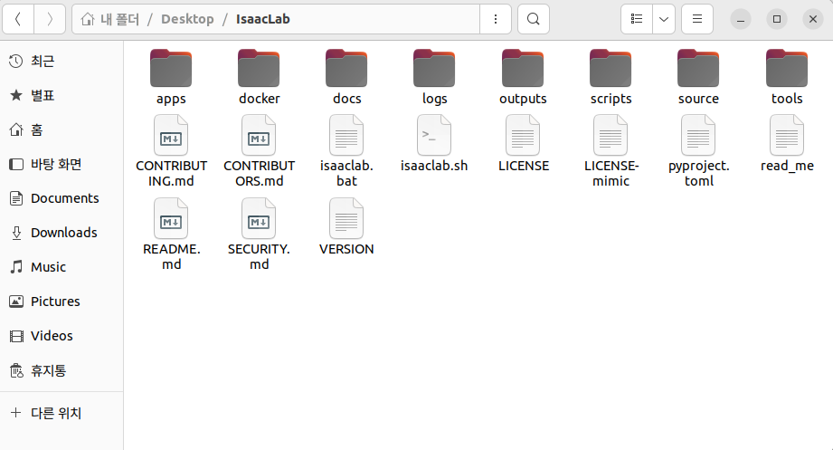

# Things to know

이 목차에서는 Isaac Lab을 사용하기 전에 알고 있으면 좋을 내용들에 대해서 정리해 놓았습니다. 실행이 우선이면 example을 통해 예제로 바로 넘어가셔도 되고 전반적인 Isaac Lab의 설명이 필요하신 분은 이 목차의 글을 확인하시면 좋을 것 같습니다.

## Directory structure




먼저 Isaac Lab을 활용하기 위해서는 프로젝트의 폴더 구조를 이해하는 것이 중요합니다. 주요 디렉토리와 그 역할은 다음과 같습니다:

<pre>
IsaacLab  
├── isaaclab.sh                     # Isaac Lab을 실행할 수 있는 주요 스크립트 모음  
├── source                          # 핵심 소스 코드들이 모여 있는 디렉토리  
│   ├── isaaclab                    # Isaac Lab의 환경 생성을 위한 기본 모듈들  
│   ├── isaaclab_assets             # 로봇 관절 및 액추에이터 config 정의  
│   ├── isaaclab_mimic              # 모방 학습 관련 기능을 포함하는 모듈  
│   ├── isaaclab_rl                 # 강화학습 알고리즘 및 설정이 정의된 모듈  
│   └── isaaclab_tasks              # 다양한 Task의 환경 정의가 들어있는 모듈 
├── scripts                         # 실행 가능한 예제 스크립트 및 실험 구성  
│   ├── benchmarks                  # 벤치마크 환경 테스트를 위한 스크립트  
│   ├── demos                       # 데모 실행을 위한 스크립트  
│   ├── environments                # 환경 목록 조회, 등록 등을 위한 유틸리티  
│   ├── imitation_learning          # imitation learning 학습 및 평가 스크립트  
│   ├── reinforcement_learning      # 강화 학습 실행을 위한 학습/평가 스크립트  
│   ├── tools                       # 데이터 처리, 시각화 등 부가적인 유틸리티 모음  
│   └── tutorials                   # 튜토리얼 예제 코드가 위치한 디렉토리  
├── logs                            # 학습 또는 평가 중 생성되는 로그 파일 저장 폴더  
└── README.md                       # Isaac Lab 프로젝트 개요와 사용법이 담긴 문서  
</pre>

위의 폴더 구조에서 환경을 새로 만들거나 수정할 경우 source 폴더의 isaaclab 혹은 isaaclab_tasks를 가장 많이 사용하게 됩니다. 또한 새로운 robot이나 에이전트들을 등록하게 된다면 isaaclab_assets를 통해서 에이전트를 등록해야 합니다. Isaaclab_assets와 관련해서 새로운 robot을 등록하기 위한 자료는 밑에 TIPS에 추가해 두었습니다. 

isaaclab과 isaaclab_tasks의 내부를 확인해보게 된다면 다음과 같습니다.

<pre>
isaaclab/  
├── actuators/      # 토크, 속도, 위치 제어 등을 담당하는 액추에이터 관련 로직 정의  
├── app/            # Isaac Lab 실행을 위한 애플리케이션 설정 및 진입점   
├── assets/         # 로봇, 환경, 물체 등에서 사용되는 USD 에셋 구성  
├── controllers/    # 로봇의 행동 제어를 위한 컨트롤러(예: PD, 모션 트래킹 등) 정의  
├── devices/        # IMU, ForceSensor 등 로봇 하드웨어 장치 모델링  
├── envs/           # Direct 및 Manager 기반 환경 로직 정의 (강화학습 환경 포함)  
├── managers/       # Manager 기반 환경을 구성하는 보상, 관측, 종료 조건 등의 모듈  
├── markers/        # 디버깅 및 시각화를 위한 마커 객체 정의 (e.g., 축, 텍스트 표시 등)  
├── scene/          # 시뮬레이션 Scene 구성 관련 유틸리티 및 객체 배치 관리  
├── sensors/        # 카메라, 깊이 센서 등 시뮬레이션 센서 모델 정의  
├── sim/            # 시뮬레이션 설정, 복제, 클로너 등 물리 엔진 관련 모듈  
├── terrains/       # 지형 생성 유틸리티 및 커스텀 지형 클래스들 (e.g., rough, stairs)  
├── ui/             # 사용자 인터페이스(UI) 및 Jupyter 위젯 연동 관련 모듈  
├── utils/          # 공통 유틸리티 함수들 (좌표 변환, 초기화 등)  
└── __init__.py     # Python 패키지로 인식되기 위한 초기화 파일  
</pre>


isaaclab_tasks의 경우에는 direct와 manager-based로 나뉘어 있으며 필요에 따라 원하는 환경을 들어가 확인해보시면 될 것 같습니다.

## Available environments

Isaac Lab은 다양한 로봇 제어 및 강화 학습 실험을 위한 환경들을 제공합니다. 각 환경은 특정 로봇 유형, 제어 목적, 시뮬레이션 설정에 따라 구성되어 있으며 여러 카테고리로 나뉩니다.

이와 관련한 문서의 링크를 하이퍼링크를 통해 남깁니다.

[Isaac Lab에서 사용 가능한  Environment](https://isaac-sim.github.io/IsaacLab/main/source/overview/environments.html).

또한 IsaacLab폴더에서 shell 스크립트를 통해서 사용가능한 env목록들을 확인할 수 있습니다.

```bash
./isaaclab.sh -p scripts/environments/list_envs.py
```

이러한 환경을 강화학습을 통해 학습시키는 명령어는 다음과 같습니다.

```bash
python scripts/reinforcement_learning/<specific-rl-library>/train.py --task=<Task-Name>
```
specific-rl-library 부분에 사용 가능한 강화학습 라이브러리를 선택해주고  원하는 환경을 Task-Name 부분에 작성하면 됩니다.


실제 예시는 다음과 같습니다.

```bash
./isaaclab.sh -p scripts/reinforcement_learning/rsl_rl/train.py --task Isaac-Velocity-Flat-Unitree-Go2-v0 
```

이 코드를 실행하는 영상을 하단에 첨부합니다.


<video width="680" height="382.5" controls>
  <source src="assets/video/스크린캐스트 05-14-2025 02:46:11 PM.webm" type="video/webm">
  Your browser does not support the video tag.
</video>

또한 zero-action 혹은 random-action을 통해 환경을 확인하고 싶다면 하단의 명령어를 사용하면 됩니다.

```bash
python scripts/zero_agent.py --task=<Task-Name>
```

```bash
python scripts/random_agent.py --task=<Task-Name>
```

## Task design

Isaac Lab에서의 Task는 특정 에이전트(로봇)에 대한 관측(observations)과 행동(actions)을 정의하는 환경(environment)으로 구성됩니다. 이러한 환경은 에이전트에게 현재 상태를 제공하고, 에이전트의 행동을 시뮬레이션을 통해 실행합니다. Isaac Lab은 이러한 Task를 설계하기 위해 Manager-based와 direct 같은 두 가지 주요 워크플로우를 제공합니다:

### Manager-based 워크플로우


Manager 기반 환경은 Task를 여러 개의 독립적인 구성 요소(Managers)로 분해하여 모듈화된 구현을 지원합니다. 각 Manager는 보상 계산, 관측 처리, 행동 적용, 무작위화 등 특정 기능을 담당하며, 사용자는 각 Manager에 대한 구성 클래스를 정의합니다. 이러한 Managers는 envs.ManagerBasedEnv를 상속하는 환경 클래스에 의해 조정되며, 다양한 구성을 쉽게 교체하거나 확장할 수 있습니다.

**장점:**
  - 모듈화된 설계로 구성 요소의 재사용 및 유지보수에 유리
  - 다양한 구성을 실험하고 검증하는데 유리
  - 협업 시 각 구성 요소를 독립적으로 개발하고 통합할 수 있음

**단점:**

 - 구현의 복잡성이 증가할 수 있으며, 각 Manager 간의 상호작용을 명확히 이해해야 사용 가능
 - 세밀한 제어가 필요한 경우에는 Direct에 비해 제한적

Manager-based로 작성된 reward함수는 다음과 같습니다.

```python
@configclass
class RewardsCfg:
    """Reward terms for the MDP."""

    # (1) Constant running reward
    alive = RewTerm(func=mdp.is_alive, weight=1.0)
    # (2) Failure penalty
    terminating = RewTerm(func=mdp.is_terminated, weight=-2.0)
    # (3) Primary task: keep pole upright
    pole_pos = RewTerm(
        func=mdp.joint_pos_target_l2,
        weight=-1.0,
        params={"asset_cfg": SceneEntityCfg("robot", joint_names=["cart_to_pole"]), "target": 0.0},
    )
    # (4) Shaping tasks: lower cart velocity
    cart_vel = RewTerm(
        func=mdp.joint_vel_l1,
        weight=-0.01,
        params={"asset_cfg": SceneEntityCfg("robot", joint_names=["slider_to_cart"])},
    )
    # (5) Shaping tasks: lower pole angular velocity
    pole_vel = RewTerm(
        func=mdp.joint_vel_l1,
        weight=-0.005,
        params={"asset_cfg": SceneEntityCfg("robot", joint_names=["cart_to_pole"])},
    )
```

### Direct 워크플로우


Direct 워크플로우는 전통적인 환경 구현 방식과 유사하게, 단일 클래스에서 보상 함수, 관측 처리, 리셋 조건 등을 직접 구현합니다. 이 접근 방식은 envs.DirectRLEnv 또는 envs.DirectMARLEnv를 상속하여 사용하며, Manager 클래스를 사용하지 않고 전체 환경 로직을 직접 제어할 수 있습니다.

**장점:**
  - 환경 로직에 대한 완전한 제어가 가능하여 복잡한 로직 구현에 적합
  - PyTorch JIT 또는 Warp와 같은 최적화 기법을 활용하여 성능을 향상시킬 수 있음
  - IsaacGymEnvs 또는 OmniIsaacGymEnvs에서 마이그레이션하는 사용자에게 친숙한 구조

**단점:**

 - 구현의 재사용성과 모듈화가 제한적
 - 구성 요소의 교체나 확장이 Manager 기반 워크플로우에 비해 어려움
 

Direct로 작성된 reward함수는 다음과 같습니다. 
 
```python
@torch.jit.script
def compute_rewards(
    rew_scale_alive: float,
    rew_scale_terminated: float,
    rew_scale_pole_pos: float,
    rew_scale_cart_vel: float,
    rew_scale_pole_vel: float,
    pole_pos: torch.Tensor,
    pole_vel: torch.Tensor,
    cart_pos: torch.Tensor,
    cart_vel: torch.Tensor,
    reset_terminated: torch.Tensor,
):
    rew_alive = rew_scale_alive * (1.0 - reset_terminated.float())
    rew_termination = rew_scale_terminated * reset_terminated.float()
    rew_pole_pos = rew_scale_pole_pos * torch.sum(torch.square(pole_pos).unsqueeze(dim=1), dim=-1)
    rew_cart_vel = rew_scale_cart_vel * torch.sum(torch.abs(cart_vel).unsqueeze(dim=1), dim=-1)
    rew_pole_vel = rew_scale_pole_vel * torch.sum(torch.abs(pole_vel).unsqueeze(dim=1), dim=-1)
    total_reward = rew_alive + rew_termination + rew_pole_pos + rew_cart_vel + rew_pole_vel
    return total_reward
```    
